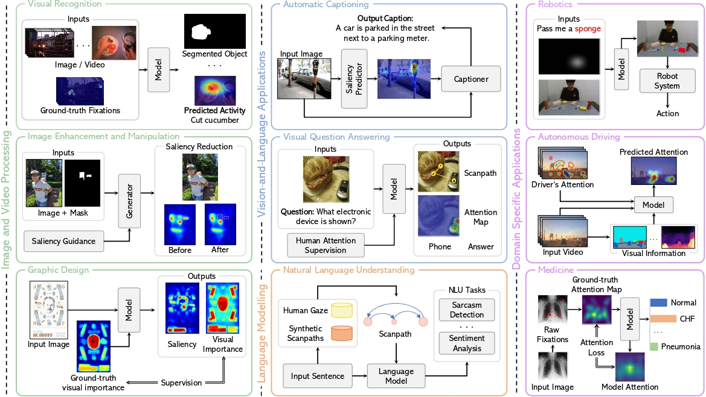

# Human Visual Attention 
This repository contains a curated list of research papers and resources focusing on saliency and scanpath prediction, human attention, human visual search.

❗ Latest Update: 20 April 2024.
❗This repo is a work in progress. New updates coming soon, stay tuned!! :construction:

## 📣 Latest News 📣
- **`20 April 2024`** Our survey paper has been accepted for publication to **IJCAI2024 Survey Track**!

## Our Survey on Human Visual Attention 👀

🔥🔥 [*Trends, Applications, and Challenges in Human Attention Modelling*](http://arxiv.org/abs/2402.18673) 🔥🔥\
\
**Authors:** 
[**Giuseppe Cartella**](https://scholar.google.com/citations?hl=en&user=0sJ4VCcAAAAJ),
[**Marcella Cornia**](https://scholar.google.com/citations?user=DzgmSJEAAAAJ&hl=it&oi=ao),
[**Vittorio Cuculo**](https://scholar.google.com/citations?user=usEfqxoAAAAJ&hl=it&oi=ao),
[**Alessandro D'Amelio**](https://scholar.google.com/citations?user=chkawtoAAAAJ&hl=it&oi=ao),
[**Dario Zanca**](https://scholar.google.com/citations?user=KjwaSXkAAAAJ&hl=it&oi=ao),
[**Giuseppe Boccignone**](https://scholar.google.com/citations?user=LqM0uJwAAAAJ&hl=it&oi=ao),
[**Rita Cucchiara**](https://scholar.google.com/citations?user=OM3sZEoAAAAJ&hl=it&oi=ao)

    

# 📚 Table of Contents
- **Human Attention Modelling**
    - 

        
Saliency Prediction

        
        | **Year** | **Conference / Journal** | **Title** | **Authors** | **Links** |
        |:--------:|:--------------:|:----------------------------------------------------|:---------------------|:---------:|
        |   2024   |      WACV      | Learning Saliency from Fixations | *Yasser Abdelaziz Dahou Djilali et al.*    | [📜 Paper](https://arxiv.org/pdf/2311.14073.pdf) / [Code :octocat:](https://github.com/YasserdahouML/SalTR) 
        |   2023   |      CVPR      | Learning from Unique Perspectives: User-aware Saliency Modeling | *Shi Chen et al.*    | [📜 Paper](https://openaccess.thecvf.com//content/CVPR2023/papers/Chen_Learning_From_Unique_Perspectives_User-Aware_Saliency_Modeling_CVPR_2023_paper.pdf) 
        |   2023   |      CVPR      | TempSAL - Uncovering Temporal Information for Deep Saliency Prediction | *Bahar Aydemir et al.*    | [📜 Paper](https://openaccess.thecvf.com/content/CVPR2023/papers/Aydemir_TempSAL_-_Uncovering_Temporal_Information_for_Deep_Saliency_Prediction_CVPR_2023_paper.pdf) / [Code :octocat:](https://github.com/IVRL/Tempsal)
        |   2023   |      BMVC      | Clustered Saliency Prediction | *Rezvan Sherkat et al.*    | [📜 Paper](https://arxiv.org/pdf/2207.02205.pdf)
        |   2023   |      NeurIPS      | What Do Deep Saliency Models Learn about Visual Attention? | *Shi Chen et al.*    | [📜 Paper](https://arxiv.org/pdf/2310.09679.pdf) / [Code :octocat:](https://github.com/szzexpoi/saliency_analysis)
        |   2022   |      Neurocomputing      | TranSalNet: Towards perceptually relevant visual saliency prediction | *Jianxun Lou et al.*    | [📜 Paper](https://www.sciencedirect.com/science/article/pii/S0925231222004714?via%3Dihub) / [Code :octocat:](https://github.com/LJOVO/TranSalNet?tab=readme-ov-file)
      |   2020   |      CVPR      | STAViS: Spatio-Temporal AudioVisual Saliency Network | *Antigoni Tsiami et al.*    | [📜 Paper](https://arxiv.org/pdf/2001.03063.pdf) / [Code :octocat:](https://github.com/atsiami/STAViS)
      |   2020   |      CVPR      | How much time do you have? Modeling multi-duration saliency | *Camilo Fosco et al.*    | [📜 Paper](https://openaccess.thecvf.com/content_CVPR_2020/papers/Fosco_How_Much_Time_Do_You_Have_Modeling_Multi-Duration_Saliency_CVPR_2020_paper.pdf) / [Code :octocat:](https://github.com/diviz-mit/multiduration-saliency/) / [Project Page](http://multiduration-saliency.csail.mit.edu/)
      |   2018   |      IEEE Transactions on Image Processing      | Predicting Human Eye Fixations via an LSTM-based Saliency Attentive Model | *Marcella Cornia et al.*    | [📜 Paper](https://arxiv.org/pdf/1611.09571.pdf) / [Code :octocat:](https://github.com/marcellacornia/sam)
        |   2015   |      CVPR      | SALICON: Saliency in Context | *Ming Jiang et al.*    | [📜 Paper](https://openaccess.thecvf.com/content_cvpr_2015/papers/Jiang_SALICON_Saliency_in_2015_CVPR_paper.pdf) / [Project Page](http://salicon.net/)
        |   2009   |      ICCV      | Learning to Predict Where Humans Look | *Tilke Judd et al.*    | [📜 Paper](https://ieeexplore.ieee.org/stamp/stamp.jsp?tp=&arnumber=5459462)
        |   1998   |      TPAMI      | A Model of Saliency-Based Visual Attention for Rapid Scene Analysis | *Laurent Itti et al.*    | [📜 Paper](https://forums.cs.tau.ac.il/~hezy/Vision%20Seminar/koch%20attention%20pami.pdf)
    

    
    - 

        
Scanpath Prediction

    
        | **Year** | **Conference / Journal** | **Title** | **Authors** | **Links** |
        |:--------:|:--------------:|:---------:|:-----------:|:---------:|
        |   2024   |      CVPR      | Beyond Average: Individualized Visual Scanpath Prediction | *Xianyu Chen et al.*    | [📜 Paper](https://arxiv.org/pdf/2404.12235.pdf)
        |   2024   |      CVPR      | Unifying Top-down and Bottom-up Scanpath Prediction Using Transformers | *Zhibo Yang et al.*    | [📜 Paper](https://arxiv.org/pdf/2303.09383.pdf) / [Code :octocat:](https://github.com/cvlab-stonybrook/HAT)
        |   2023   |      arXiv      | Contrastive Language-Image Pretrained Models are Zero-Shot Human Scanpath Predictors | *Dario Zanca et al.*    | [📜 Paper](https://arxiv.org/pdf/2305.12380.pdf) / [Code + Dataset :octocat:](https://github.com/mad-lab-fau/CapMIT1003)
        |   2023   |      CVPR      | Gazeformer: Scalable, Effective and Fast Prediction of Goal-Directed Human Attention | *Sounak Mondal et al.*    | [📜 Paper](https://arxiv.org/pdf/2303.15274.pdf) / [Code :octocat:](https://github.com/cvlab-stonybrook/Gazeformer/)
        |   2022   |      ECCV      | Target-absent Human Attention | *Zhibo Yang et al.*    | [📜 Paper](https://arxiv.org/pdf/2207.01166.pdf) / [Code :octocat:](https://github.com/cvlab-stonybrook/Target-absent-Human-Attention)
        |   2022   |      Journal of Vision      | DeepGaze III: Modeling free-viewing human scanpaths with deep learning | *Matthias Kümmerer et al.*    | [📜 Paper](https://jov.arvojournals.org/article.aspx?articleid=2778776) / [Code :octocat:](https://github.com/matthias-k/DeepGaze)
        |   2021   |      CVPR      | Predicting Human Scanpaths in Visual Question Answering | *Xianyu Chen et al.*    | [📜 Paper](https://openaccess.thecvf.com/content/CVPR2021/papers/Chen_Predicting_Human_Scanpaths_in_Visual_Question_Answering_CVPR_2021_paper.pdf) / [Code :octocat:](https://github.com/chenxy99/Scanpaths)
        |   2019   |      TPAMI      | Gravitational Laws of Focus of Attention | *Dario Zanca et al.*    | [📜 Paper](https://ieeexplore.ieee.org/abstract/document/8730418) / [Code :octocat:](https://github.com/dariozanca/G-Eymol)
        |   2015   |      Vision Research      | Saccadic model of eye movements for free-viewing condition | *Olivier Le Meur et al.*    | [📜 Paper](https://www.sciencedirect.com/science/article/pii/S0042698915000504)
    

- **Integrating Human Attention in AI models**
    - ***Image and Video Processing***
        - 

            
Visual Recognition

            
            | **Year** | **Conference / Journal** | **Title** | **Authors** | **Links** |
            |:--------:|:--------------:|:---------:|:-----------:|:---------:|
            |    2023  |    IJCV    |    Joint Learning of Visual-Audio Saliency Prediction and Sound Source Localization on Multi-face Videos    | *Minglang Qiao et al.*    | [📜 Paper](https://link.springer.com/article/10.1007/s11263-023-01950-3) / [Code :octocat:](https://github.com/MinglangQiao/MVVA-Database?tab=readme-ov-file)
            |    2022  |    ECML PKDD    |    Foveated Neural Computation    | *Matteo Tiezzi et al.*    | [📜 Paper](https://2022.ecmlpkdd.org/wp-content/uploads/2022/09/sub_620.pdf) / [Code :octocat:](https://github.com/sailab-code/foveated_neural_computation)
            |    2021  |    WACV    |    Integrating Human Gaze into Attention for Egocentric Activity Recognition    | *Kyle Min et al.*    | [📜 Paper](https://openaccess.thecvf.com/content/WACV2021/papers/Min_Integrating_Human_Gaze_Into_Attention_for_Egocentric_Activity_Recognition_WACV_2021_paper.pdf) / [Code :octocat:](https://github.com/MichiganCOG/Gaze-Attention)
            |   2019   |      CVPR      | Learning Unsupervised Video Object Segmentation through Visual Attention | *Wenguan Wang et al.*    | [📜 Paper](https://openaccess.thecvf.com/content_CVPR_2019/papers/Wang_Learning_Unsupervised_Video_Object_Segmentation_Through_Visual_Attention_CVPR_2019_paper.pdf) / [Code :octocat:](https://github.com/wenguanwang/AGS)
            |   2019   |      CVPR      | Shifting more attention to video salient object detection | *Deng-Ping Fan et al.*    | [📜 Paper](https://openaccess.thecvf.com/content_CVPR_2019/papers/Fan_Shifting_More_Attention_to_Video_Salient_Object_Detection_CVPR_2019_paper.pdf) / [Code :octocat:](https://github.com/DengPingFan/DAVSOD)
          

          
        - 

            
Graphic Design

            
            | **Year** | **Conference / Journal** | **Title** | **Authors** | **Links** |
            |:--------:|:--------------:|:---------:|:-----------:|:---------:|
            |   2020   | ACM Symposium on UIST (User Interface Software and Technology) | Predicting Visual Importance Across Graphic Design Types |      *Camilo Fosco et al.*       | [📜 Paper](https://arxiv.org/pdf/2008.02912.pdf) / [Code :octocat:](https://github.com/diviz-mit/predimportance-public)
            |   2020   | ACM MobileHCI | Understanding Visual Saliency in Mobile User Interfaces |      *Luis A. Leiva et al.*       | [📜 Paper](https://arxiv.org/pdf/2101.09176.pdf)
            |   2017   | ACM Symposium on UIST (User Interface Software and Technology) | Learning Visual Importance for Graphic Designs and Data Visualizations |      *Zoya Bylinskii et al.*       | [📜 Paper](https://arxiv.org/pdf/1708.02660.pdf) / [Code :octocat:](https://github.com/cvzoya/visimportance)
        

    
        - 

            
Image Enhancement and Manipulation

  
            | **Year** | **Conference / Journal** | **Title** | **Authors** | **Links** |
            |:--------:|:--------------:|:---------:|:-----------:|:---------:|
            |   2023   | CVPR | Realistic saliency guided image enhancement |      *S. Mahdi H. Miangoleh et al.*       | [📜 Paper](https://openaccess.thecvf.com/content/CVPR2023/papers/Miangoleh_Realistic_Saliency_Guided_Image_Enhancement_CVPR_2023_paper.pdf) / [Code :octocat:](https://github.com/compphoto/RealisticImageEnhancement) / [Project Page](https://yaksoy.github.io/realisticEditing/)
            |   2022   | CVPR | Deep saliency prior for reducing visual distraction |      *Kfir Aberman et al.*       | [📜 Paper](https://openaccess.thecvf.com/content/CVPR2022/papers/Aberman_Deep_Saliency_Prior_for_Reducing_Visual_Distraction_CVPR_2022_paper.pdf) / [Project Page](https://deep-saliency-prior.github.io/)
            |   2021   | CVPR | Saliency-guided image translation |      *Lai Jiang et al.*       | [📜 Paper](https://openaccess.thecvf.com/content/CVPR2021/papers/Jiang_Saliency-Guided_Image_Translation_CVPR_2021_paper.pdf)
            |   2017   | arXiv | Guiding human gaze with convolutional neural networks |      *Leon A. Gatys et al.*       | [📜 Paper](https://arxiv.org/pdf/1712.06492.pdf)
        

        
        - 

            
Image Quality Assessment

 
            | **Year** | **Conference / Journal** | **Title** | **Authors** | **Links** |
            |:--------:|:--------------:|:---------:|:-----------:|:---------:|
            |   2023   | CVPR | ScanDMM: A Deep Markov Model of Scanpath Prediction for 360° Images |      *Xiangjie Sui et al.*       | [📜 Paper](https://openaccess.thecvf.com/content/CVPR2023/papers/Sui_ScanDMM_A_Deep_Markov_Model_of_Scanpath_Prediction_for_360deg_CVPR_2023_paper.pdf) / [Code :octocat:](https://github.com/xiangjieSui/ScanDMM)
            |   2021   | ICCV Workshops | Saliency-Guided Transformer Network combined with Local Embedding for No-Reference Image Quality Assessment |      *Mengmeng Zhu et al.*       | [📜 Paper](https://openaccess.thecvf.com/content/ICCV2021W/AIM/papers/Zhu_Saliency-Guided_Transformer_Network_Combined_With_Local_Embedding_for_No-Reference_Image_ICCVW_2021_paper.pdf)
            |   2019   | ACMMM | SGDNet: An End-to-End Saliency-Guided Deep Neural Network for No-Reference Image Quality Assessment |      *Sheng Yang et al.*       | [📜 Paper](https://dl.acm.org/doi/pdf/10.1145/3343031.3350990) / [Code :octocat:](https://github.com/ysyscool/SGDNet)
        

    - ***Vision-and-Language Applications***
        - 

            
Automatic Captioning

 
            | **Year** | **Conference / Journal** | **Title** | **Authors** | **Links** |
            |:--------:|:--------------:|:---------:|:-----------:|:---------:|
            |   2020   | EMNLP | Generating Image Descriptions via Sequential Cross-Modal Alignment Guided by Human Gaze |      *Ece Takmaz et al.*       | [📜 Paper](https://aclanthology.org/2020.emnlp-main.377.pdf) / [Code :octocat:](https://github.com/dmg-illc/didec-seq-gen)
            |   2019   | ICCV | Human Attention in Image Captioning: Dataset and Analysis |      *Sen He et al.*       | [📜 Paper](https://openaccess.thecvf.com/content_ICCV_2019/papers/He_Human_Attention_in_Image_Captioning_Dataset_and_Analysis_ICCV_2019_paper.pdf) / [Code :octocat:](https://github.com/SenHe/Human-Attention-in-Image-Captioning)
            |   2018   | ACM TOMM | Paying More Attention to Saliency: Image Captioning with Saliency and Context Attention |      *Marcella Cornia et al.*       | [📜 Paper](https://arxiv.org/pdf/1706.08474.pdf)
            |   2017   | CVPR | Supervising Neural Attention Models for Video Captioning by Human Gaze Data |      *Youngjae Yu et al.*       | [📜 Paper](https://openaccess.thecvf.com/content_cvpr_2017/papers/Yu_Supervising_Neural_Attention_CVPR_2017_paper.pdf) / [Code :octocat:](https://github.com/yj-yu/Recurrent_Gaze_Prediction)
            |   2016   | arXiv | Seeing with Humans: Gaze-Assisted Neural Image Captioning |      *Yusuke Sugano et al.*       | [📜 Paper](https://arxiv.org/pdf/1608.05203.pdf)
            
        

        
        - 

            
Visual Question Answering

 
            | **Year** | **Conference / Journal** | **Title** | **Authors** | **Links** |
            |:--------:|:--------------:|:---------:|:-----------:|:---------:|
            |   2023   | EMNLP | GazeVQA: A Video Question Answering Dataset for Multiview Eye-Gaze Task-Oriented Collaborations |      *Muhammet Furkan Ilaslan et al.*       | [📜 Paper](https://aclanthology.org/2023.emnlp-main.648.pdf) / [Code :octocat:](https://github.com/mfurkanilaslan/GazeVQA)
            |   2023   | CVPR Workshops | Multimodal Integration of Human-Like Attention in Visual Question Answering |      *Ekta Sood et al.*       | [📜 Paper](https://openaccess.thecvf.com/content/CVPR2023W/GAZE/papers/Sood_Multimodal_Integration_of_Human-Like_Attention_in_Visual_Question_Answering_CVPRW_2023_paper.pdf) / [Project Page](https://perceptualui.org/publications/sood23_gaze/)
            |   2021   | CoNLL | VQA-MHUG: A Gaze Dataset to Study Multimodal Neural Attention in Visual Question Answering |      *Ekta Sood et al.*       | [📜 Paper](https://aclanthology.org/2021.conll-1.3.pdf) / [Dataset + Project Page](https://perceptualui.org/publications/sood21_conll/)
            |   2020   | ECCV | AiR: Attention with Reasoning Capability |      *Shi Chen et al.*       | [📜 Paper](https://www.ecva.net/papers/eccv_2020/papers_ECCV/papers/123460086.pdf) / [Code :octocat:](https://github.com/szzexpoi/AiR)
            |   2018   | AAAI | Exploring Human-like Attention Supervision in Visual Question Answering |      *Tingting Qiao et al.*       | [📜 Paper](https://arxiv.org/pdf/1709.06308.pdf) / [Code :octocat:](https://github.com/qiaott/HAN) 
            |   2016   | EMNLP | Human Attention in Visual Question Answering: Do Humans and Deep Networks Look at the Same Regions? |      *Abhishek Das et al.*       | [📜 Paper](https://aclanthology.org/D16-1092.pdf)
 
          
        

    - ***Language Modelling***
        - 

            
Machine Reading Comprehension

 
            | **Year** | **Conference / Journal** | **Title** | **Authors** | **Links** |
            |:--------:|:--------------:|:---------:|:-----------:|:---------:|
            |   2023   | ACL Workshops | Native Language Prediction from Gaze: a Reproducibility Study |      *Lina Skerath et al.*       | [📜 Paper](https://aclanthology.org/2023.acl-srw.26.pdf) / [Code :octocat:](https://github.com/linaskerath/ANLP_project)
            |   2022   | ETRA | Inferring Native and Non-Native Human Reading Comprehension and Subjective Text Difficulty from Scanpaths |      *David R. Reich et al.*       | [📜 Paper](https://dl.acm.org/doi/pdf/10.1145/3517031.3529639) / [Code :octocat:](https://github.com/aeye-lab/etra-reading-comprehension)
            |   2017   | ACL | Predicting Native Language from Gaze |      *Yevgeni Berzak et al.*       | [📜 Paper](https://aclanthology.org/P17-1050.pdf)
 
            
        

        
        - 

            
Natural Language Understanding
    
 
            | **Year** | **Conference / Journal** | **Title** | **Authors** | **Links** |
            |:--------:|:--------------:|:---------:|:-----------:|:---------:|
            |   2023   | EMNLP | Pre-Trained Language Models Augmented with Synthetic Scanpaths for Natural Language Understanding |      *Shuwen Deng et al.*       | [📜 Paper](https://aclanthology.org/2023.emnlp-main.400.pdf) / [Code :octocat:](https://github.com/aeye-lab/EMNLP-SyntheticScanpaths-NLU-PretrainedLM)
            |   2023   | EACL | Synthesizing Human Gaze Feedback for Improved NLP Performance |      *Varun Khurana et al.*       | [📜 Paper](https://aclanthology.org/2023.eacl-main.139.pdf)
            |   2020   | NeurIPS | Improving Natural Language Processing Tasks with Human Gaze-Guided Neural Attention |      *Ekta Sood et al.*       | [📜 Paper](https://proceedings.neurips.cc/paper_files/paper/2020/file/460191c72f67e90150a093b4585e7eb4-Paper.pdf) / [Project Page](https://perceptualui.org/publications/sood20_neurips/)
          

            
        

    - ***Domain-Specific Applications***
        - 

            
Robotics

 
            | **Year** | **Conference / Journal** | **Title** | **Authors** | **Links** |
            |:--------:|:--------------:|:---------:|:-----------:|:---------:|
            |   2023   | IEEE RA-L | GVGNet: Gaze-Directed Visual Grounding for Learning Under-Specified Object Referring Intention |      *Kun Qian et al.*       | [📜 Paper](https://ieeexplore.ieee.org/stamp/stamp.jsp?arnumber=10202186)
            |   2022   | RSS | Gaze Complements Control Input for Goal Prediction During Assisted Teleoperation |      *Reuben M. Aronson et al.*       | [📜 Paper](https://harp.ri.cmu.edu/assets/pubs/aronson_gaze_to_goal_rss22.pdf)
            |   2019   | CoRL | Understanding Teacher Gaze Patterns for Robot Learning |      *Akanksha Saran et al.*       | [📜 Paper](https://proceedings.mlr.press/v100/saran20a/saran20a.pdf) / [Code :octocat:](https://github.com/asaran/gaze-LfD)
            |   2019   | CoRL | Nonverbal Robot Feedback for Human Teachers |      *Sandy H. Huang et al.*       | [📜 Paper](https://proceedings.mlr.press/v100/huang20a/huang20a.pdf)
 
        

        
        - 

            
Autonomous Driving

 
            | **Year** | **Conference / Journal** | **Title** | **Authors** | **Links** |
            |:--------:|:--------------:|:---------:|:-----------:|:---------:|
            |   2023   | ICCV | FBLNet: FeedBack Loop Network for Driver Attention Prediction |      *Yilong Chen et al.*       | [📜 Paper](https://openaccess.thecvf.com/content/ICCV2023/papers/Chen_FBLNet_FeedBack_Loop_Network_for_Driver_Attention_Prediction_ICCV_2023_paper.pdf)
            |   2022   | IEEE Transactions on Intelligent Transportation Systems | DADA: Driver Attention Prediction in Driving Accident Scenarios |      *Jianwu Fang et al.*       | [📜 Paper](https://arxiv.org/pdf/1912.12148.pdf) / [Code :octocat:](https://github.com/JWFangit/LOTVS-DADA)
            |   2021   | ICCV | MEDIRL: Predicting the Visual Attention of Drivers via Deep Inverse Reinforcement Learning |      *Sonia Baee et al.*       | [📜 Paper](https://openaccess.thecvf.com/content/ICCV2021/papers/Baee_MEDIRL_Predicting_the_Visual_Attention_of_Drivers_via_Maximum_Entropy_ICCV_2021_paper.pdf) / [Code :octocat:](https://github.com/soniabaee/MEDIRL-EyeCar) / [Project Page](https://soniabaee.github.io/projects/medirl-eyecar/medirl-eyecar.html)
            |   2020   | CVPR | “Looking at the right stuff” - Guided semantic-gaze for autonomous driving |      *Anwesan Pal et al.*       | [📜 Paper](https://openaccess.thecvf.com/content_CVPR_2020/papers/Pal_Looking_at_the_Right_Stuff_-_Guided_Semantic-Gaze_for_Autonomous_CVPR_2020_paper.pdf) / [Code :octocat:](https://github.com/anwesanpal/SAGENet_demo)
            |   2019   | ITSC | DADA-2000: Can Driving Accident be Predicted by Driver Attention? Analyzed by A Benchmark |      *Jianwu Fang et al.*       | [📜 Paper](https://arxiv.org/pdf/1904.12634.pdf) / [Code :octocat:](https://github.com/JWFangit/LOTVS-DADA)
            |   2018   | ACCV | Predicting Driver Attention in Critical Situations |      *Ye Xia et al.*       | [📜 Paper](https://arxiv.org/pdf/1711.06406.pdf) / [Code :octocat:](https://github.com/pascalxia/driver_attention_prediction)
            |   2018   | TPAMI | Predicting the Driver’s Focus of Attention: the DR(eye)VE Project |      *Andrea Palazzi et al.*       | [📜 Paper](https://arxiv.org/pdf/1705.03854.pdf) / [Code :octocat:](https://github.com/ndrplz/dreyeve)
 
        

        
        - 

            
Medicine

 
            | **Year** | **Conference / Journal** | **Title** | **Authors** | **Links** |
            |:--------:|:--------------:|:---------:|:-----------:|:---------:|
            |   2024   |      AAAI      | Mining Gaze for Contrastive Learning toward Computer-Assisted Diagnosis | *Zihao Zhao et al.*    | [📜 Paper](https://arxiv.org/pdf/2312.06069.pdf) / [Code :octocat:](https://github.com/zhaozh10/McGIP) 
            |   2024   | WACV | GazeGNN: A Gaze-Guided Graph Neural Network for Chest X-ray Classification |      *Bin Wang et al.*       | [📜 Paper](https://openaccess.thecvf.com/content/WACV2024/papers/Wang_GazeGNN_A_Gaze-Guided_Graph_Neural_Network_for_Chest_X-Ray_Classification_WACV_2024_paper.pdf) / [Code :octocat:](https://github.com/ukaukaaaa/GazeGNN)
            |   2023   |      WACV      | Probabilistic Integration of Object Level Annotations in Chest X-ray Classification | *Tom van Sonsbeek et al.*    | [📜 Paper](https://openaccess.thecvf.com/content/WACV2023/papers/van_Sonsbeek_Probabilistic_Integration_of_Object_Level_Annotations_in_Chest_X-Ray_Classification_WACV_2023_paper.pdf)
            |   2023   | IEEE Transactions on Medical Imaging | Eye-gaze-guided Vision Transformer for Rectifying Shortcut Learning |      *Chong Ma et al.*       | [📜 Paper](https://arxiv.org/pdf/2205.12466.pdf)
            |   2023   | Transactions on Neural Networks and Learning Systems | Rectify ViT Shortcut Learning by Visual Saliency |      *Chong Ma et al.*       | [📜 Paper](https://ieeexplore.ieee.org/document/10250856)
            |   2022   | IEEE Transactions on Medical Imaging | Follow My Eye: Using Gaze to Supervise Computer-Aided Diagnosis |      *Sheng Wang et al.*       | [📜 Paper](https://arxiv.org/pdf/2204.02976.pdf) / [Code :octocat:](https://github.com/JamesQFreeman/MICEYE)
            |   2022   | MICCAI | GazeRadar: A Gaze and Radiomics-Guided Disease Localization Framework |      *Moinak Bhattacharya et al.*       | [📜 Paper](https://bmi.stonybrookmedicine.edu/sites/default/files/A-Gaze-and-Radiomics-Guided-Disease-Localization-Framework.pdf) / [Code :octocat:](https://github.com/bmi-imaginelab/gazeradar)
            |   2022   | ECCV | RadioTransformer: A Cascaded Global-Focal Transformer for Visual Attention–guided Disease Classification |      *Moinak Bhattacharya et al.*       | [📜 Paper](https://www.ecva.net/papers/eccv_2022/papers_ECCV/papers/136810669.pdf) / [Code :octocat:](https://github.com/bmi-imaginelab/radiotransformer)
            |   2021   | Nature Scientific Data | Creation and validation of a chest X-ray dataset with eye-tracking and report dictation for AI development |      *Alexandros Karargyris  et al.*       | [📜 Paper](https://www.nature.com/articles/s41597-021-00863-5) / [Code :octocat:](https://github.com/cxr-eye-gaze/eye-gaze-dataset)
            |   2021   | BMVC | Human Attention in Fine-grained Classification |      *Yao Rong  et al.*       | [📜 Paper](https://www.bmvc2021-virtualconference.com/assets/papers/0421.pdf) / [Code :octocat:](https://github.com/yaorong0921/CUB-GHA)
            |   2018   | Journal of Medical Imaging | Modeling visual search behavior of breast radiologists using a deep convolution neural network |      *Suneeta Mall  et al.*       | [📜 Paper](https://www.ncbi.nlm.nih.gov/pmc/articles/PMC6086967/pdf/JMI-005-035502.pdf)
          
          
        

- **Datasets & Benchmarks 📂📎**
    - 

        
Saliency Prediction

        
        - [SALICON](http://salicon.net/download/) - [SALICON API](https://github.com/NUS-VIP/salicon-api)
        - [MIT1003](https://people.csail.mit.edu/tjudd/WherePeopleLook/index.html)
        
    

    - 

        
Scanpath Prediction

        
        - [COCOFreeView](https://sites.google.com/view/cocosearch/coco-freeview)
        - [COCOSearch18](https://sites.google.com/view/cocosearch/)
        
    

# How to Contribute 🚀

1. Fork this repository and clone it locally.
2. Create a new branch for your changes: `git checkout -b feature-name`.
3. Make your changes and commit them: `git commit -m 'Description of the changes'`.
4. Push to your fork: `git push origin feature-name`.
5. Open a pull request on the original repository by providing a description of your changes.

This project is in constant development, and we welcome contributions to include the latest research papers in the field or report issues 💥💥.
